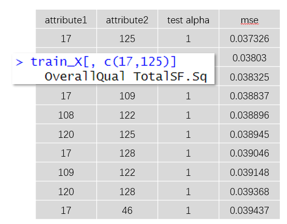
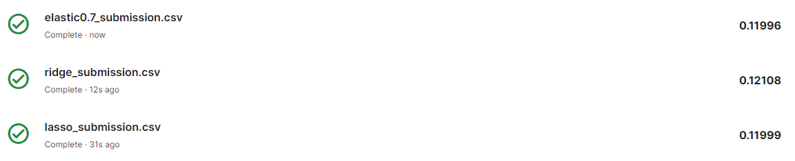
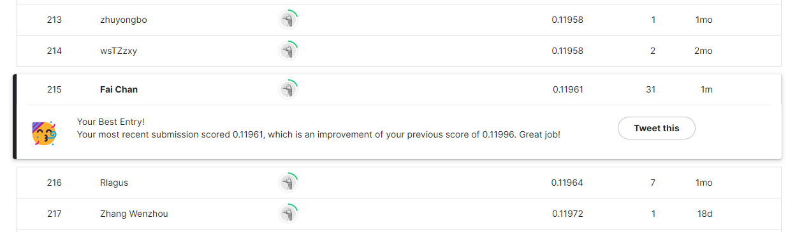

# [Group4] House Prices - Advanced Regression Techniques
The goals of this project.
redict sales prices and practice feature engineering, RFs, and gradient boosting

## shiny app
https://4pad7.shinyapps.io/group4_final_project/

## Contributors
|組員|系級|學號|工作分配|
|-|-|-|-|
|吉瀚宇|資碩工一|111753157|團隊中的吉祥物🦒，負責增進團隊氣氛| 
|思沛淇|資碩計一|111753214|團隊的中流砥柱，一個人打十個，地下勢力團員|
|陳輝|資碩計一|111753228|團隊中的吉祥物🦒，負責增進團隊氣氛|
|張義猷|資碩計一|111753230|團隊中的吉祥物🦒，負責增進團隊氣氛|
|徐宇文|資管碩一|111356003|團隊中的吉祥物🦒，負責增進團隊氣氛|

## Quick start
先跑feature_engineering file, file內已有directory, 不用pass進去了
```R
Rscript code/feature_engineering(Gary_edition).R
```

再跑analysis file, 會自己找data folder剛生成的file, 不用pass進去了
```R
Rscript code/analysis(Gary_edition).R
```

## Folder organization and its related description
idea by Noble WS (2009) [A Quick Guide to Organizing Computational Biology Projects.](https://journals.plos.org/ploscompbiol/article?id=10.1371/journal.pcbi.1000424) PLoS Comput Biol 5(7): e1000424.

### docs
* Your presentation, 1112_DS-FP_groupID.ppt/pptx/pdf (i.e.,1112_DS-FP_group1.ppt), by **06.08**
* Any related document for the project
  * i.e., software user guide

### data
* Input
  * Source [House Prices - Advanced Regression Techniques](https://www.kaggle.com/competitions/house-prices-advanced-regression-techniques/overview)
  * Format [CSV File](data/sample_submission.csv)
  * Size
    * train.csv -> 81 columns, 1460 rows
    * test.csv  -> 80 cloumns, 1459 rows
* Output 
  * [Ensamble91.csv](results/Ensamble91.csv)
### code
* Analysis steps
    * 在test.csv中新增一個 "SalePrice" 欄位，並設定初始值為 0
    * 合併train.csv以及test.csv兩個資料集
    * 數據清理和預處理：對收集到的數據進行清理和預處理，包括處理缺失值、處理異常值、數據平滑化、特徵選擇或提取
    * 根據問題的特點，對數據進行特徵工程，例如特徵縮放、特徵轉換、特徵組合等，以提取有用的信息。
    * 根據原本的特徵，再增加其他新特徵
    * 根據問題的性質和數據的特點，選擇合適的機器學習模型，並設置相應的參數。
    * 使用訓練集對選定的模型進行訓練，通過迭代優化模型的參數，以最小化訓練誤差。
    * 使用測試集評估已訓練模型的性能，例如計算準確率、精確率、召回率等指標。
    * 根據評估結果，對模型進行優化，可能需要調整模型參數、嘗試不同的特徵工程方法或嘗試其他模型。
    * 將訓練好且經過優化的模型應用於實際場景，並進行實時預測或決策。
* Which method or package do you use? 
    * method
      * glmnet
      * xgb
      * ensemble learning
      * lable encoding
      * others 
        * read.csv()：這個方法用於讀取 CSV 檔案並將其載入資料框
        * Assignment (<-)：這用於將值指派給變數或資料框中的欄位
        * colSums()：此函數計算資料框的欄位總和
        * is.na()：此函數檢查向量或資料框中的缺失值（NA）
        * which()：此函數返回邏輯值為 TRUE 的索引或位置
        * sort()：此函數按升序對向量或資料框進行排序
        * names()：此函數返回因子中的水平或值的名稱
        * factor()：此函數使用指定的水平創建一個因子變數
        * recode()：此函數用於重新編碼向量或因子中的值
      


### results
* null model - duoble variable nodel


* comparison


* How do your perform evaluation?
  * Cross-validation
  * 
* final result


## References
* Packages you use
  * dplyr：這個套件提供了用於資料操作和轉換的函數
  * tidyr：這個套件提供了整理和重塑資料的函數
  * ggplot2：這個套件用於資料視覺化
  * glmnet：這個套件提供了用於擬合帶有正則化的廣義線性模型的函數
  * stringr：這個套件提供了字串操作的函數
  * xgboost：這個套件用於梯度提升
* Related publications
